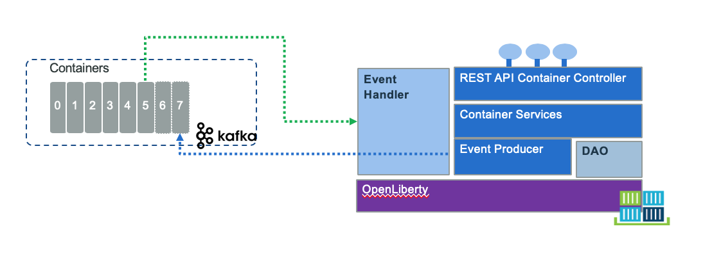

# Reefer Container management microservice

This project is part of the container shipment implementation solution, and address the Reefer container management microservice implmentaiton. You can read more about the end to end solution [in this chapter.](https://ibm-cloud-architecture.github.io/refarch-kc/)

The goal of this Container management service is to support the reefer containers inventory management and to process all the events related to the container entity. 

We are documenting the best practices related to the different implementations of this service in [a book format](https://ibm-cloud-architecture.github.io/refarch-kc-container-ms) to make the navigation easier. 

Updated 06/05/2019.

## Implementations

We are proposing different implementations for this service:

* [Using kafka streams API within a microprofile web app](./docs/kstreams/README.md)
* [Using Spring boot app, Postgresql spring data template and kafka spring template](./docs/springboot/README.md)
* [A python implementation](./docs/flask/README.md).




## Build and run

Each implementation has its own scripts to build and run. Therefor we are detailing in each sub project how to run and build them:

* Springboot app build and run see [this note](https://ibm-cloud-architecture.github.io/refarch-kc-container-ms/springboot/) for detail.

### Building this booklet locally

The content of this repository is written with markdown files, packaged with [MkDocs](https://www.mkdocs.org/) and can be built into a book-readable format by MkDocs build processes.

1. Install MkDocs locally following the [official documentation instructions](https://www.mkdocs.org/#installation).
1. Install Material plugin for mkdocs:  `pip install mkdocs-material` 
2. `git clone https://github.com/ibm-cloud-architecture/refarch-kc-container-ms.git` _(or your forked repository if you plan to edit)_
3. `cd refarch-kc-container-ms`
4. `mkdocs serve`
5. Go to `http://127.0.0.1:8000/` in your browser.

### Pushing the book to GitHub Pages

1. Ensure that all your local changes to the `master` branch have been committed and pushed to the remote repository.
   1. `git push origin master`
2. Ensure that you have the latest commits to the `gh-pages` branch, so you can get others' updates.
	```bash
	git checkout gh-pages
	git pull origin gh-pages
	
	git checkout master
	```
3. Run `mkdocs gh-deploy` from the root refarch-da directory.

--- 

## Contribute

We welcome your contributions. There are multiple ways to contribute: report bugs and improvement suggestion, improve documentation and contribute code.
We really value contributions and to maximize the impact of code contributions we request that any contributions follow these guidelines:

The [contributing guidelines are in this note.](./CONTRIBUTING.md)

## Contributors

* [Shilpi Bhattacharyya](https://www.linkedin.com/in/shilpibhattacharyya/)
* [Hemankita Perabathini](https://www.linkedin.com/in/hemankita-perabathini/)
* [Jerome Boyer](https://www.linkedin.com/in/jeromeboyer/)
