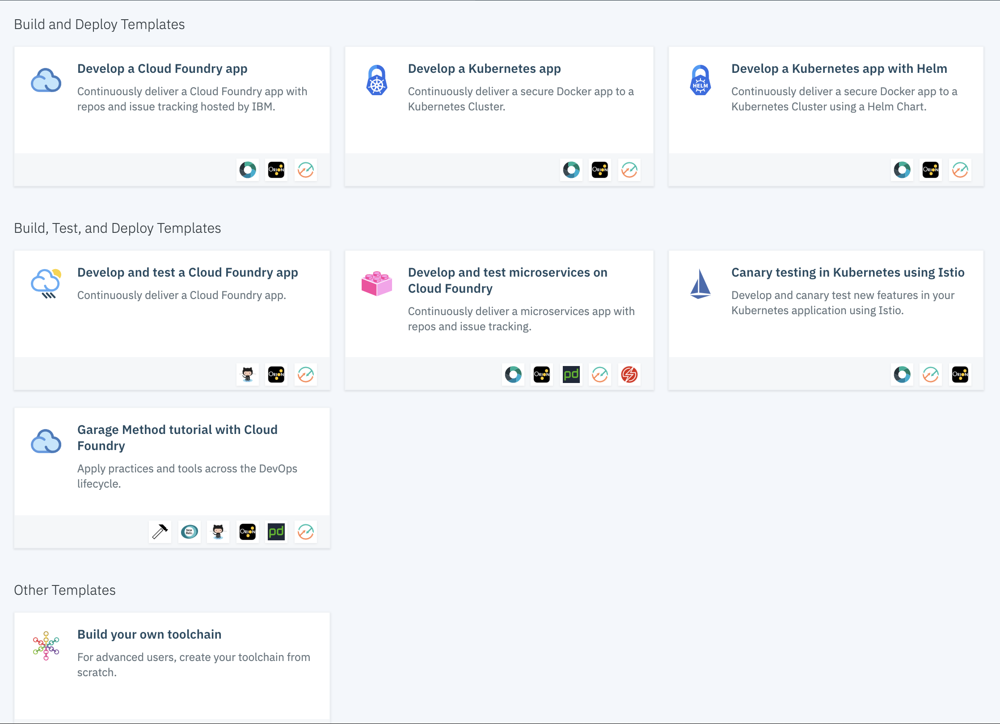
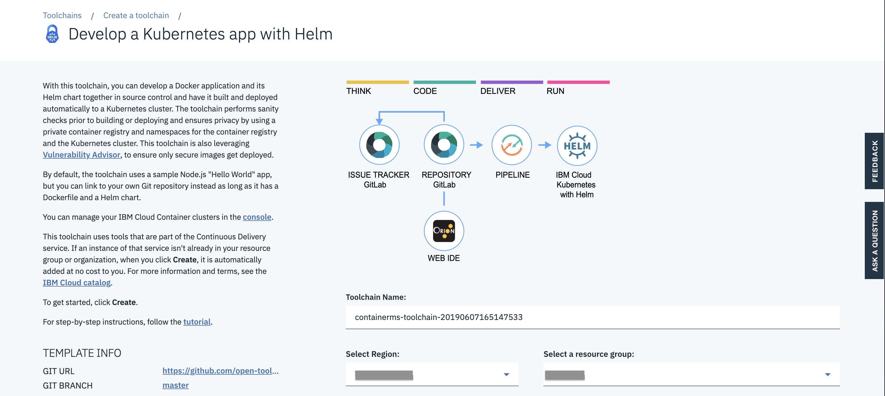
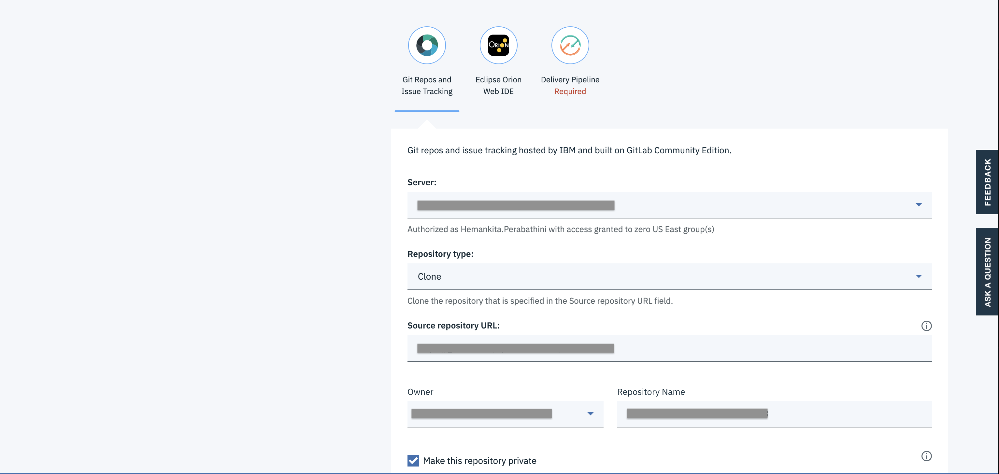
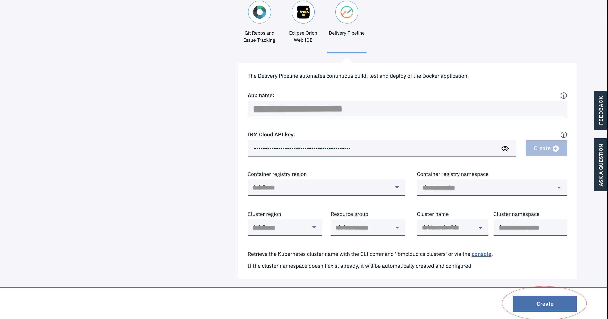
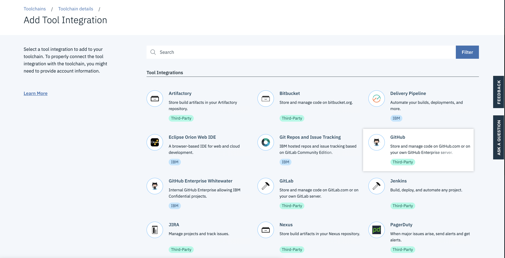
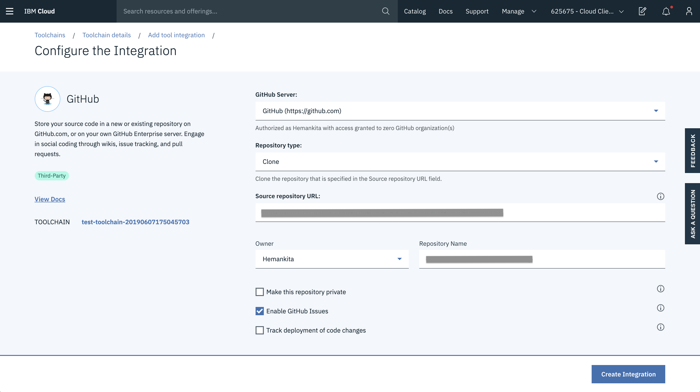
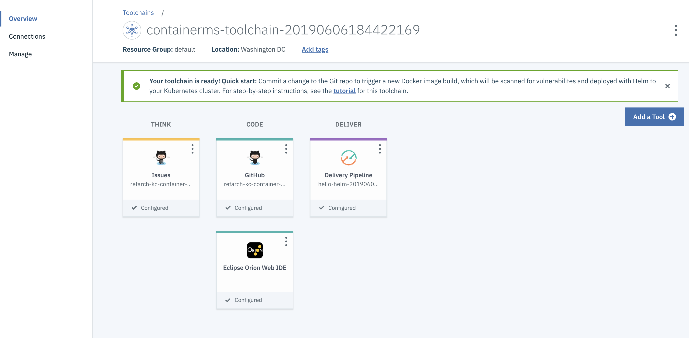
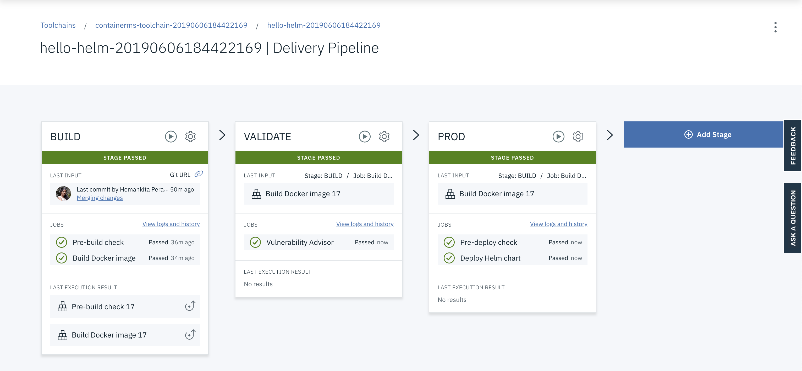

# Continuous delivery

For the SpringContainerMS service, we are using the one of the existing toolchains on IBM Cloud.

## Creating a Toolchain

1. To create one, go to search bar, type toolchains and it will take to below screen.

2. Choose `Develop a Kubernetes app with Helm` and it will take you to the creation page.

- Enter the Toolchain Name.
- Choose a Region.
- Select a Resource group.

3. Scroll down and you will see some more details. Fill them out as well.

- Mention the server.
- You can clone or use an existing repository.
- Provide the repo URL.
- Give the repo a name.

4. Now go to the `Delivery Pipeline` Section.

- Provide app a name.
- Create IBM Cloud API key.
- Choose a container registry region and namespace.
- Select a cluster region, resource group, cluster name and cluster namespace.

5. Now go ahead and click `create`.

## Tool Integration

You can add additional tools as follows. For this application, we are adding the github integration.

And then add the details of your repository.

Based on your requirements you can also add other tools.

Since we don't need Git provided by the default Toolchian, we deleted it.

## Toolchain

Once configured, our toolchain looks like below.

1. Clicking on `Issues` takes you to the Github Issues page.

2. Clicking on `Github` takes you to the Github repository.

3. `Delivery Pipeline` is the most important piece where we defined our Build, Validate and Prod stages as follows.

If you click on the settings of each stage, you will have an option called `Configure Stage`. Using this, you can modify the input, jobs and environment variables based on your requirements.

Also, in the validate phase, vulnerability advisor is one of the security features provided by IBM Cloud. It scans the security status of the docker images that are pushed to the registry namespace. When the image is added to the namespace, it will be scanned automatically by the vulnerability advisor to detect the security issues and potential vulnerabilities.

It will generate a report suggesting the fixes. You can also add exemptions based on your requirements. Fixing the issues that are reported can help you to secure your IBM Cloud infrastructure.

One more thing to know is whenever there is any change committed to your github repo, the toolchain will trigger the delivery pipeline automatically and the app with the latest changes will be deployed to your environment.
