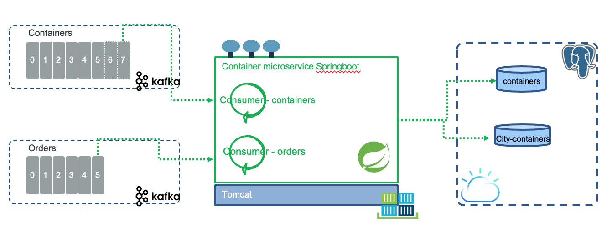
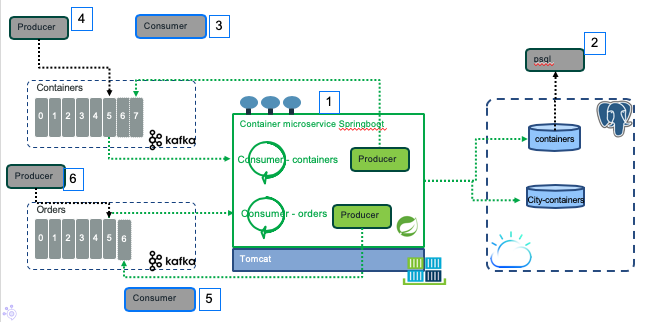
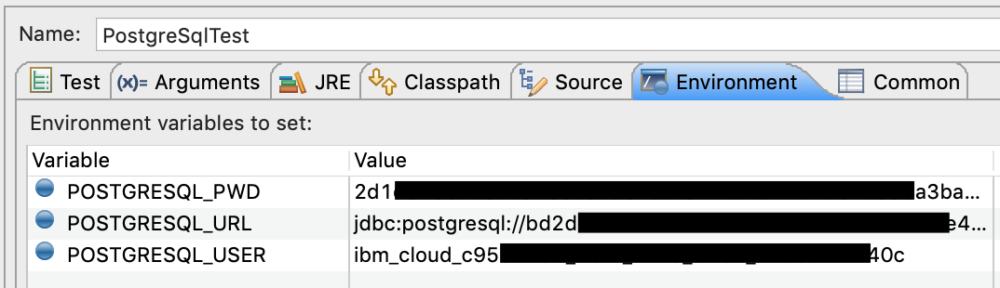

# Springboot - Kafka container microservice

This chapter presents how to develop the Reefer container manager using Spring boot, Kafka template and PostgreSQL, Hibernate JPA and Spring data. This is another way to implement the same specifications and helps us to assess the different technologies to develop event-driven cloud native microservice. The user stories to support are described in [this section](../index.md).



The application is built around the following components:

* A Postgresql repository to support CRUD operations for Reefer containers
* A kafka consumer for container events, to get the container data and call the repository to save new container or update existing one.
* A new Order consumer to get order created event, and then search matching container(s) taking into account the product type, the quantity and the pickup address. It uses the postgresql repository to find the list of Reefer candidates.
* An order producer to send containerId - Order ID assignment event to the orders topic using order ID as key
* A container producer to send containerId - Order ID assignment event to the container topic, using container ID as key.
* Expose RESTful APIs to be a reusable service too.

We are addressing one of the characteristics of microservice 'reversibility' with this project: the programming style and deployment to different cloud platform. We try to answer the following questions:

* How to deploy to IBM Cloud kubernetes service and in one command, taking the same code version and deploying it to IBM Cloud Private behind the firewall with all the related components available on that plaform?
* How to adopt control the dependencies and the configuration factors (See [The 12 factors app](https://12factor.net/)) to facilitate reversibility?

## Starting code

We have found it is necessary to combine different starter code as the basic spring boot generated code is not useful.

### Start from Spring initializer

Using the [Spring Code generator](https://start.spring.io/) we created the base project. 


The generated code is really minimum and the interesting part is the maven `pom.xml` dependencies. We do not have code related to the selected dependant, no dockerfile and all the goodies to deploy to Kubernetes cluster. 

It is more convenient to start from IBM Cloud starter kit and modify the generared `pom.xml` with the needed dependencies...

## Start from IBM Cloud Starter Kit.

Once logged to IBM Cloud, create a resource and select `Starter kit` in the Catalog, then the `Java microservice with Spring` kit. 


The application is created, we can download the code or create a toolchain so we can use a continuous integration and deployment to an existing IBM Kubernetes Service.


Now the code repository has Dockerfile, helm chart, CLI configuration, scripts and other manifests... We can build existing code and run it with the following commands:

```shell
$ mvn clean package
$ java -jar target/SpringContainerMS-1.0-SNAPSHOT.jar application.SBApplication
```

Pointing to http://localhost:8080/ will bring the first page. It works! So let break it.

If you did not try it before, and if you are using [Eclipse](https://www.eclipse.org/) last release, you can install Eclipse Spring IDE plugin: open Eclipse Marketplace and search for Spring IDE, and then download release 4.x:


To verify the installation, importing our project as a 'maven' project will let you see the different options like spring boot starters election, etc...

The tool is also available for IDE visual studio code. See [this note](https://spring.io/tools) for Spring toools. 

### New pom    

The generated dependencies include Spring boot starter web code, hystrix for circuit breaker and retries, and testing. We need to add kafka and postgreSQL dependencies and re-run `mvn install`.
```
<dependency>
    <groupId>org.springframework.kafka</groupId>
    <artifactId>spring-kafka</artifactId>
</dependency>

<dependency>
    <groupId>org.postgresql</groupId>
    <artifactId>postgresql</artifactId>
    <scope>runtime</scope>
</dependency>
<dependency>
    <groupId>org.springframework.kafka</groupId>
    <artifactId>spring-kafka-test</artifactId>
    <scope>test</scope>
</dependency>
```

## Some Spring boot basis 

We encourage you to go over the different tutorials from spring.io. We followed the following ones to be sure we have some good understanding of the basic components:

* [Springboot](https://spring.io/guides/gs/spring-boot/). Helps to start quickly application. The first class as the main function and run the SpringApplcation. The `@SpringBootApplication` annotation adds configuration to get the spring bean definitions, and auto configure the bean jars needed. As we specified the `pring-boot-starter-web` artifact in the dependencoes the application is a web MVC and includes a Dispatcher servlet. 
* [Data with JPA](https://spring.io/guides/gs/accessing-data-jpa/) addresses creating entity beans, repository as data access object and queries. 
* [Spring Boot, PostgreSQL, JPA, Hibernate RESTful CRUD API Example from Callicoder](https://www.callicoder.com/spring-boot-jpa-hibernate-postgresql-restful-crud-api-example/)
* [Spring Kafka](https://spring.io/projects/spring-kafka)

## Add the get /containers  API

We want to start by the get reefer containers test and then implement a simple container controller bean with the CRUD operations. Spring takes into account the package names to manage its dependencies and settings. The test looks like below:

```java
@Test
public void testGetContainers() throws Exception {
    String endpoint = "http://localhost:" + port + "/containers";
    String response = server.getForObject(endpoint, String.class);
    assertTrue("Invalid response from server : " + response, response.startsWith("["));
}
```
Spring Boot provides a @SpringBootTest annotation to build an application context used for the test. Below we specify to use Spring unit test runner, and to load the configuration from the main application class. The server used above is auto injected by the runner.

```java
@RunWith(SpringRunner.class)
@SpringBootTest(classes=SBApplication.class,webEnvironment = WebEnvironment.RANDOM_PORT)
public class ContainerAPITest {
     @Autowired
    private TestRestTemplate server;

    @LocalServerPort
    private int port;
    
```

The next step is to implement the controller class under the package `ibm.labs.kc.containermgr.rest.containers`. 

```java
package ibm.labs.kc.containermgr.rest.containers;
@RestController
public class ContainerController {

    @GetMapping("containers")
    public List<ContainerEntity> getAllContainers() {
    	return new ArrayList<ContainerEntity>;
    }
``` 

The ContainerEntity is a class with JPA annotations, used to control the object to table mapping. Below is a [simple entity definition](https://github.com/ibm-cloud-architecture/refarch-kc-container-ms/blob/14cc515787a7aeeebf38c703473ab32622c56b93/SpringContainerMS/src/main/java/ibm/labs/kc/containermgr/model/ContainerEntity.java#L21-L47):

```java
@Entity
@Table(name = "containers")
public class ContainerEntity implements java.io.Serializable {
	
	@Id
	protected String id;
    protected String type;
	protected String status;
	protected String brand;
}
```

Once we have defined the entity attributes and how it is mapped to the table column, the next major step is to add a repository class: [ContainerRepository.java](https://github.com/ibm-cloud-architecture/refarch-kc-container-ms/blob/master/SpringContainerMS/src/main/java/ibm/labs/kc/containermgr/dao/ContainerRepository.java) and configure the application to use Postgress dialect so JPA can generate compatible DDLs. The repository is scrary easy, it just extends a base JpaRepository and specifies the primary key used as ID and the type of record as ContainerEntity.

```java
@Repository
public interface ContainerRepository extends JpaRepository<ContainerEntity,String>{}
```

Spring makes it magic to add save, findById, findAll... operations transparently. So now we can @Autowrite the repository and add the tests and the connection between the rest api and the repo. The test is in the Junit test class: [PostgreSqlTest](src/test/java/ibm/labs/kc/containermgr/PostgreSqlTest.java). In fact for test reason and being able to inject Mockup class in unit test, we inject via contructor.

```java
@Test
	public void testAccessToRemoteDBSpringDatasource() {
		Optional<ContainerEntity> cOut = containerRepo.findById("c1");
		if (!cOut.isPresent()) {
			ContainerEntity c = new ContainerEntity("c1","Brand","Reefer",100,0,0);
			c.setCreatedAt(new Date());
			c.setUpdatedAt(c.getCreatedAt());
			containerRepo.save(c);
            // add asserts...
        }
    }
```

Finally the controller is integrating the repository:
```java
    @Autowired
	private ContainerRepository containerRepository;

    @GetMapping("/containers/{containerId}")
    public ContainerEntity getContainerById(@PathVariable String containerId) {
    	return containerRepository.findById(containerId)
    			.orElseThrow(() -> 
    	 new ResourceNotFoundException("Container not found with id " + containerId));
    }

```
The test fails as it is missing the configuration to the postsgresql service. As we do not want to hardcode the password and URL end point or share secret in public github we define the configuration using environment variables. See the [application.properties](https://github.com/ibm-cloud-architecture/refarch-kc-container-ms/blob/master/SpringContainerMS/src/main/resources/application.properties) file. We have two choices for the Postgresql service: one using IBM Cloud and one running local docker image. 

To export the different environment variables we have a `setenv.sh` script (which we have defined a template for) with different arguments to control Kafka and Postgresql parameters (LOCAL, IBMCLOUD, ICP). 

To execute against the remote postgresql use:
```shell
# Under the SpringContainerMS folder
$ source ../scripts/setenv.sh IBMCLOUD
$ mvn test
```

To run locally start the backend services (see ) and use:
```shell
$ source ../scripts/setenv.sh LOCAL
$ mvn test
```

After the tests run successfully with a valid connection to IBM cloud, launching the spring boot app location and going to http://localhost:8080/containers/c1 will give you the data for the Container "c1".   

## Preparing your test environment

We propose to use the local deployment to do unit tests and integration tests. The integration test for this application is quite complex and we propose to use a diagram to illustrate the components involved and how to start them.

First be sure your back end services run: It will start zookeeper, kafka and postgresql. You need the [refarch-kc main project for that](https://ibm-cloud-architecture.github.io/refarch-kc/) which normally can be in one folder above this current project. To start the backend:

```shell
$ cd refarch-kc/docker
$ docker-compose -f backbone-compose.yml up`

Starting docker_zookeeper1_1  ... done
Creating docker_postgres-db_1 ... done
Starting docker_kafka1_1      ... done
```
> if you need to restart from empty topics, delete the kafka1 and zookeeper1 folders under `refarch-kc/docker`

#### The integration tests 



    
| ID | Description | Run |
| --- | --- | --- |
| 1  | Springboot app which includes kafka consumers and producers, REST API and postgresql DAO | ./scripts/run.sh |
| 2 | **psql** to access postgresql DB | ../scripts/start_spql |
| 3 | containers consumer. To trace the *containers* topics. This code is in refarch-kc project in `itg-tests/ContainersPython` folder. | Use a Terminal console: refarch-kc/itg-tests/ContainersPython/ runContainerConsumer.sh LOCAL c01 |
| 4 | container events producer. To generate events. This code is in refarch-kc project in `itg-tests/ContainersPython` folder. | Use a Terminal console: refarch-kc/itg-tests/ContainersPython/ addContainer.sh LOCAL c01 |
| 5 | orders consumer. To trace the *orders* topics. This code is in refarch-kc project in `itg-tests/OrdersPython` folder. | Use a Terminal console:refarch-kc/itg-tests/OrdersPython/ runOrderConsumer.sh LOCAL order01 |
| 6 | orders events producer. To generate order events. This code is in refarch-kc project in `itg-tests/OrdersPython` folder. | Use a Terminal console: refarch-kc/itg-tests/OrdersPython/ addOrder.sh LOCAL order01 |


Here is an example of traces after sending 2 container creation events in terminal console (#3):

```
@@@ pollNextOrder containers partition: [0] at offset 4 with key b'itg-C02':
	value: {"containerID": "itg-C02", "timestamp": 1556250004, "type": "ContainerAdded", "payload": {"containerID": "itg-C02", "type": "Reefer", "status": "Empty", "latitude": 37.8, "longitude": -122.25, "capacity": 110, "brand": "itg-brand"}}
@@@ pollNextOrder containers partition: [0] at offset 5 with key b'itg-c03':
	value: {"containerID": "itg-c03", "timestamp": 1556250673, "type": "ContainerAdded", "payload": {"containerID": "itg-c03", "type": "Reefer", "status": "Empty", "latitude": 37.8, "longitude": -122.25, "capacity": 110, "brand": "itg-brand"}}
```

Which can be verified in the (#1) trace:

```
2019-04-25 16:52:11.245  INFO 17734 --- [ingConsumer-C-1] c.l.k.c.kafka.ContainerConsumer          : Received container event: {"containerID": "itg-C02", "timestamp": 1556250004, "type": "ContainerAdded", "payload": {"containerID": "itg-C02", "type": "Reefer", "status": "Empty", "latitude": 37.8, "longitude": -122.25, "capacity": 110, "brand": "itg-brand"}}
```

And in console for container producer (#4)

```
Create container
{'containerID': 'itg-C02', 'timestamp': 1556250004, 'type': 'ContainerAdded', 'payload': {'containerID': 'itg-C02', 'type': 'Reefer', 'status': 'Empty', 'latitude': 37.8, 'longitude': -122.25, 'capacity': 110, 'brand': 'itg-brand'}}
Message delivered to containers [0]

```

Finally in the psql console:

```
postgres=# SELECT * FROM containers;
   id    |   brand   | capacity |       created_at        | current_city | latitude | longitude | status |  type  |       updated_at        
---------+-----------+----------+-------------------------+--------------+----------+-----------+--------+--------+-------------------------

 itg-C02 | itg-brand |      110 | 2019-04-25 16:28:26.885 | Oakland      |     37.8 |   -122.25 |      1 | Reefer | 2019-04-25 20:40:04.579
 itg-c03 | itg-brand |      110 | 2019-04-25 20:51:13.424 | Oakland      |     37.8 |   -122.25 |      1 | Reefer | 2019-04-25 20:51:13.424
```

> The capacity is at maximum and the status = 1 is for empty container.

When an order is created in console #6, a matching container is found and 2 events are created to present the container id and order id in both topics: containers and orders:

#### Console 6: Create order

```shell
$ ./addOrder.sh LOCAL order02

Create order
{'orderID': 'order04', 'timestamp': 1556252841, 'type': 'OrderCreated', 'payload': {'orderID': 'order04', 'productID': 'FreshFoodItg', 'customerID': 'Customer007', 'quantity': 180, 'pickupAddress': {'street': 'astreet', 'city': 'Oakland', 'country': 'USA', 'state': 'CA', 'zipcode': '95000'}, 'destinationAddress': {'street': 'bstreet', 'city': 'Beijing', 'country': 'China', 'state': 'NE', 'zipcode': '09000'}, 'pickupDate': '2019-05-25', 'expectedDeliveryDate': '2019-06-25'}}
Message delivered to orders [0]
```
#### Console 5: consumer orders

```
	value: {"orderID": "order04", "timestamp": 1556252841, "type": "OrderCreated", "payload": {"orderID": "order04", "productID": "FreshFoodItg", "customerID": "Customer007", "quantity": 180, "pickupAddress": {"street": "astreet", "city": "Oakland", "country": "USA", "state": "CA", "zipcode": "95000"}, "destinationAddress": {"street": "bstreet", "city": "Beijing", "country": "China", "state": "NE", "zipcode": "09000"}, "pickupDate": "2019-05-25", "expectedDeliveryDate": "2019-06-25"}}
@@@ pollNextOrder orders partition: [0] at offset 5 with key b'order04':
	value: {"orderID":"order04","payload":{"containerID":"itg-c03","orderID":"order04"},"timestamp":1556252842194,"type":"ContainerAllocated"}
```

#### Console 1: app

```
2019-04-25 21:27:21.765  INFO 21610 --- [ingConsumer-C-1] c.l.kc.containermgr.kafka.OrderConsumer  : Received order event:{"orderID": "order04", "timestamp": 1556252841, "type": "OrderCreated", "payload": {"orderID": "order04", "productID": "FreshFoodItg", "customerID": "Customer007", "quantity": 180, "pickupAddress": {"street": "astreet", "city": "Oakland", "country": "USA", "state": "CA", "zipcode": "95000"}, "destinationAddress": {"street": "bstreet", "city": "Beijing", "country": "China", "state": "NE", "zipcode": "09000"}, "pickupDate": "2019-05-25", "expectedDeliveryDate": "2019-06-25"}}


2019-04-25 21:27:22.199  INFO 21610 --- [ingConsumer-C-1] c.l.k.c.kafka.OrderProducerImpl          : Emit order event:{"orderID":"order04","payload":{"containerID":"itg-c03","orderID":"order04"},"timestamp":1556252842194,"type":"ContainerAllocated"}

2019-04-25 21:27:22.273  INFO 21610 --- [ingConsumer-C-1] c.l.k.c.kafka.ContainerProducerImpl      : Emit container event:{"containerID":"itg-c03","payload":{"containerID":"itg-c03","orderID":"order04"},"timestamp":1556252842272,"type":"ContainerAssignedToOrder"}

```

#### Console 3: Containers consumer
```
@@@ pollNextOrder containers partition: [0] at offset 6 with key b'itg-c03':
	value: {"containerID":"itg-c03","payload":{"containerID":"itg-c03","orderID":"order04"},"timestamp":1556252842272,"type":"ContainerAssignedToOrder"}
```

#### Console 2

The postgresql containers table is also modified as capacity of the container is reduced by the order quantity and the status set to loaded (value 0):

```
postgres=# SELECT * FROM containers;
   id    |   brand   | capacity |       created_at        | current_city | latitude | longitude | status |  type  |       updated_at        
---------+-----------+----------+-------------------------+--------------+----------+-----------+--------+--------+-------------------------
 itg-C02 | itg-brand |        0 | 2019-04-25 16:28:26.885 | Oakland      |     37.8 |   -122.25 |      0 | Reefer | 2019-04-25 21:24:57.821
 itg-c03 | itg-brand |        0 | 2019-04-25 20:51:13.424 | Oakland      |     37.8 |   -122.25 |      0 | Reefer | 2019-04-25 21:27:22.159
```

## Build with docker

To support flexible CI/CD deployment and run locally we propose to use Docker [multi-stage build](https://docs.docker.com/develop/develop-images/multistage-build/). 

As part of the CI/CD design, there is an important subject to address is how to support integration tests. Unit tests focus on validating the business logic, while integration tests validate the end to end integration of the microservices with its dependants services and products. We separated the unit tests and integration tests in their own Java packages. Later it will be more appropriate to have a separate code repository for integration tests. 

Integration tests in this project access remote postegresql server. When the server is in IBM Cloud as part of the postgresql service, a SSL Certificate is defined as part of the service credentials. When building with Docker multi-stage this means the build stage has to get certificate in Java TrustStore so tests are successful. We burnt time on this one. We recommend reading the [security section](#security) below to see what commands to run to get certificate in good format and create truststore. Those commands have to be done in the dockerfile too and certificate, URL, user, password has to be injected using Dockerfile arguments and then environment variables. 

See the `scripts/buildDocker.sh` to assess the docker build parameters used. And then how to manage the certificate creation into the Java TrustStore using scripts like `add_certificates.sh`. This script needs to be executed before the maven build so any integration tests that need to access the remote Postgresql server will not fail with SSL handcheck process. And it needs to be done in the docker final image as part of the startup of the spring boot app (see `startup.sh`). 

## Listening to container events

The use story is to get the container event from the kafka `containers` topics and add new Reefer container data to the inventory, or update existing container. So we need to add consumer and publisher using [Spring Kafka](https://spring.io/projects/spring-kafka). Spring Kafka template is based on the pure java kafka-clients jar but provides the same encapsulation as Spring JMS template. Here is the [product documentation](https://docs.spring.io/spring-kafka/docs/2.2.4.RELEASE/reference/).  

First we need to start a kafka consumer when the application starts. We want one unique instance, so a singleton. As presented in [this article](https://www.baeldung.com/running-setup-logic-on-startup-in-spring), we select to add a Component that is an application listener (Annotation @EventListener) so when the spring context is running, we can start consuming message from Kafka.  

```java
@Component
public class ContainerConsumer {
    @EventListener
    public void onApplicationEvent(ContextRefreshedEvent event) {
        // prepare kafka consumer, add an event handler callback and start the consumer
}
```

The code is in the class: `ibm.labs.kc.containermgr.kafka.ContainerConsumer.java`. Spring Kafka container](https://docs.spring.io/spring-kafka/docs/2.2.4.RELEASE/reference/#receiving-messages) is not bringing that much value on top of Kafka Java API, and we prefer learning a unique API and keep programming with the Kafka Java API. 

We have added an end to end integration test to create container events and see the payload persisted in Postgresql.  When running the server locally, you may want to leverage our [docker compose](https://github.com/ibm-cloud-architecture/refarch-kc/blob/master/docker/backbone-compose.yml) file to start a local kafka broker. 

## Listening to Order Event

The approach is the same as above and the supporting class is: [ibm.labs.kc.containermgr.kafka.OrderConsumer](https://github.com/ibm-cloud-architecture/refarch-kc-container-ms/blob/master/SpringContainerMS/src/main/java/ibm/labs/kc/containermgr/kafka/OrderConsumer.java).

The difference is in the search for container for the order: 
## Security

To communicate with IBM Cloud PostgresSQl service the client needs to use SSL certificates... 
First to avoid sharing userid and password in github, we use environment variables for postgressql url, user and password. There is a `setenv.tmpl.sh` in the `scripts` folder to use with your own settings. Rename it `setenv.sh`. This file is ignored by git. The values are coming from the IBM Cloud postgresql service. Also to run unit test in eclipse you need to set those environment variables in the run configuration as illustrated in the figure below:



Those variables are used the Spring boot `application.configuration` file, for example for the postgresql URL:

```
spring.datasource.url=${POSTGRESQL_URL}
```

When the Spring repository class establishes a TLS or SSL communication to the Postgresql service in IBM Cloud (or ICP), both client and server negotiate a stateful connection by using a handshaking procedure. During this procedure, the server usually sends back its identification in the form of a digital certificate.

Java programs store certificates in a repository called Java KeyStore (JKS). 

To create the SSL connection you will need to make the server public certificate available to your Java client JVM. The certificate is persisted in a Trustore. So get the server public certificate: `postgresql.crt`, then convert it to a form Java understands.
To download a text version of the base64 certificate as defined in the connection credentials of the IBM Cloud postgressql service use the following command:

```shell
$ ibmcloud cdb deployment-cacert Green-DB-PostgreSQL
# if you do not have the cloud database plugin does the following and rerun previous command:
$ ibmcloud plugin install cloud-databases
```
Save the certificate to a file (e.g. postgressql.crt). Then transform it to a Java format and save it to a keystore used by Java

```shell
# transform
$ openssl x509 -in postgressql.crt -out postgressql.crt.der -outform der
# save in keystore
$ keytool -keystore clienttruststore -alias postgresql -import -file postgressql.crt.der -storepass changeit 
```

Then adding the following setting will let the Java program accesses the certificates from the keystore.

```
java -jar -Djavax.net.ssl.trustStore=clienttruststore -Djavax.net.ssl.trustStorePassword=changeit ./target/SpringContainerMS-1.0-SNAPSHOT.jar application.SBApplication
```

We recommend reading [this section](https://jdbc.postgresql.org/documentation/91/ssl-client.html) of Postgresql product documentation, and [this article from Baeldung](https://www.baeldung.com/java-ssl-handshake-failures) on SSL handshake in Java.

Now to make all this available in docker container we propose to let the previous two commands run within the Dockerfile during the build process.

## Manually deploy to IKS

The steps are the same as other project and we are providing the same type of tools:

```shell
# login to IBM Cloud
$ ibmcloud login -a https://api.us-east.bluemix.net
# connect to the IKS cluster
$ ibmcloud ks region-set us-east   
$ ibmcloud ks cluster-config fabio-wdc-07
$ export KUBECONFIG= ~/.bluemix/plugins/container-service/clusters/fabio-wdc-07/kube-config-wdc07-fabio-wdc-07.yml
# login to the private registry
$ ibmcloud cr login
# build the jar and docker image
$ ./script/buildDocker.sh IBMCLOUD
# Push the image
$ docker push  us.icr.io/ibmcaseeda/kc-springcontainerms
# Deploy the Helm release
$ ./scripts/deployHelm
```

If for any reason you get a "image can't be pulled" error. Verify the image is in the registry with the command: `docker cr image-list`. Then if so, verify there is a secret defined to keep the security key to access the registry in the same namespace as you are deploying your app, and this secret is referenced in the yml file:

```
"imagePullSecrets": [
          {
            "name": "browncompute-registry-secret"
          }
        ],
```


## Issues

The level of abstraction in Spring is nice when doing basic things but can become a nightmare when doing real bigger application including different libraries. Also migrating or using the last version 2.xx, bring changes to existing code and tests. Below is a list of iisues we spent time on:

* When JPA started, it creates / updates database schema, and for example enforced to have an Id as int while it was as string. As a bypass we create the table before in postsgresql using psql tool.
* When starting the spring data, JPA will try to connect to the PostgresSQL and execute a set of validation, one of them could generate the following exception: `Method org.postgresql.jdbc.PgConnection.createClob() is not yet implemented`. The explanation for the solution is [here](https://vkuzel.com/spring-boot-jpa-hibernate-atomikos-postgresql-exception)
* Testing endpoint /health did not work on Spring 2.1.4. Thisi s due that there is the new Actuator capabilities (`spring-boot-starter-actuator`) that adds endpoints to manage a webapp in production. This is a nice feature. So remove any hold Health api class and modify the url to `/actuator/health`. Be sure to read [this note](https://docs.spring.io/spring-boot/docs/current/reference/html/production-ready-endpoints.html) on actuator.

* Deployed in Kubernetes service, the pod has issue on postgress SSL handshake. (org.postgresql.util.PSQLException: SSL error: Received fatal alert: handshake_failure). SSL handshakes are a mechanism by which a client and server establish the trust and logistics required to secure their connection over the network. This problem may be linked to a SSL certificate not found or wrong encryption protocol. We need to be sure a Java Keystore is defined and includes the public certificate coming from the server. See [security section](#security) above.


## References

* [Spring Code generator](https://start.spring.io/)
* [Spring Kafka](https://spring.io/projects/spring-kafka) and the spring kafka [documentation](https://docs.spring.io/spring-kafka/docs/2.2.4.RELEASE/reference)
* [sptring Data and JPA](https://docs.spring.io/spring-data/jpa/docs/current/reference/html/)
* [SSL and postgresql]()
* [Runninf postgresql in docker](http://tleyden.github.io/blog/2017/06/14/running-postgresql-in-docker/)