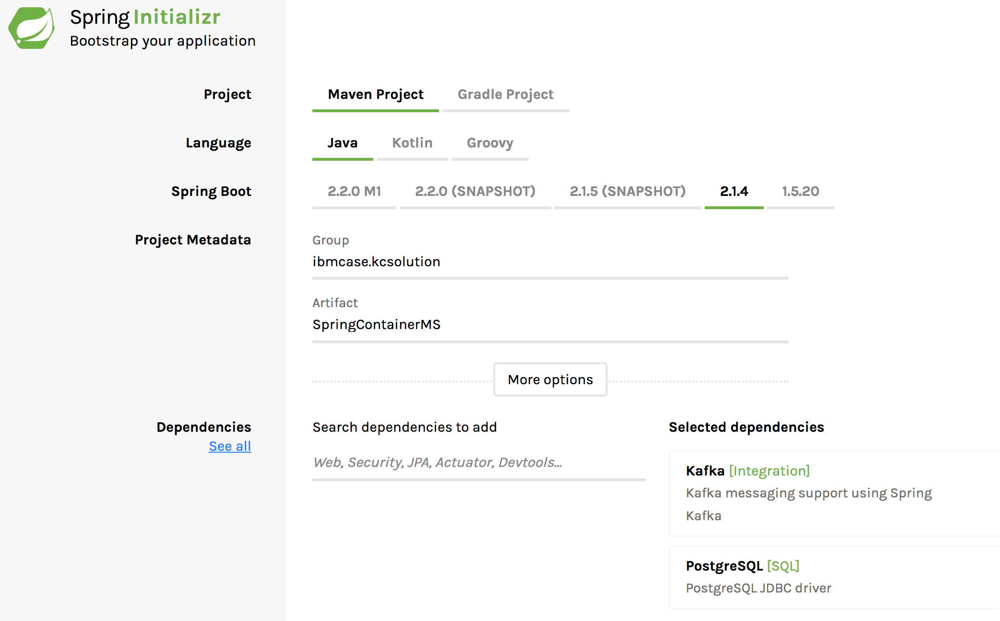
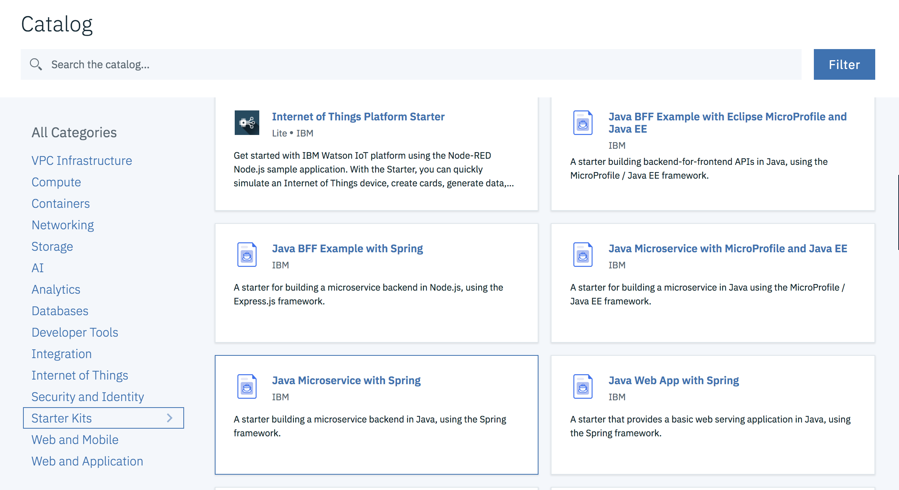
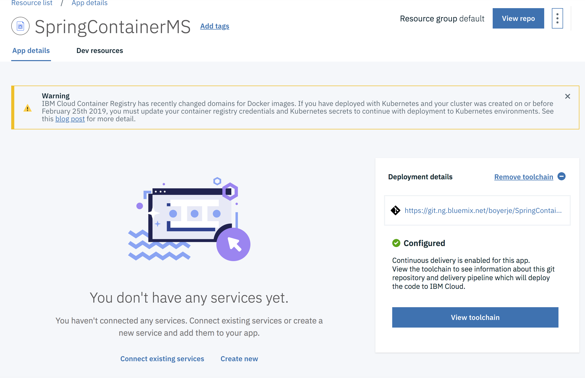
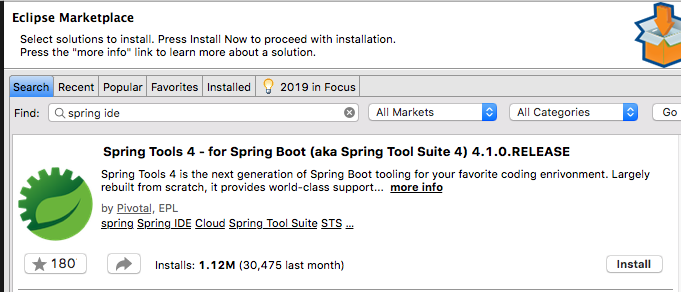

# Springboot - kafka container microservice


## Start from Spring initializer

Using the [Spring Code generator](https://start.spring.io/) we create the base project. 



The generated code is really minimum and the interesting part is the pom dependencies. We do not have code related to the selected dependant, no dockerfile and all the goodies to deploy to IBM Kubernetes Service are not there. In fact, if you have a cloud foundry organization defined the IBM cloud, you can use the IBM Cloud CLI for developer to add docker, helm and other things. 

It is possible, and more convenient to start from IBM Cloud starter kit and modify the generared `pom.xml`.

## Start from IBM Cloud Starter Kit.

Once logged to IBM Cloud, create a resource and select Starter kit in the Catalog.



The application is created, you can download the code or create a toolchain so we can deploy to an existing IBM Kubernetes Service.



So now the repository has Dockerfile, helm chart, CLI configuration... We can build and run with the following commands:

```shell
$ mvn clean package
$ java -jar target/SpringContainerMS-1.0-SNAPSHOT.jar application.SBApplication
```

Pointing to http://localhost:8080/ will bring the first page. It works! so let break it.

We need to merge both code or modify the pom and run `mvn install`. Before that as we are using Eclipse last release we can install Spring IDE plugin. Before that ensure you get the last updates from eclipse, uisng the 'update Software' menu. If not the installation may fail. See [this note](https://www.eclipse.org/community/eclipse_newsletter/2018/february/springboot.php) in case you want to know how to do that, but this is simple, open Marketplace and search for Spring IDE, download release 4.x:




### New pom    

The generated dependencies include Spring boot starter web code, hystrix for circuit breaker and retries, and testing. We need to add kafka and postgreSQL
```
<dependency>
    <groupId>org.springframework.kafka</groupId>
    <artifactId>spring-kafka</artifactId>
</dependency>

<dependency>
    <groupId>org.postgresql</groupId>
    <artifactId>postgresql</artifactId>
    <scope>runtime</scope>
</dependency>
<dependency>
    <groupId>org.springframework.kafka</groupId>
    <artifactId>spring-kafka-test</artifactId>
    <scope>test</scope>
</dependency>
```

Then reun `mvn install`.

## Some Springboot knowledge

We encourage you to go over the different tutorials from spring.io. We followed these ones to be sure we got understanding of the basic components:

* [Springboot](https://spring.io/guides/gs/spring-boot/). Helps to start quickly application. The first class as the main function and run the SpringApplcation. The `@SpringBootApplication` annotation adds configuration to get the spring bean definitions, and auto configure the bean jars needed. As we specified the `pring-boot-starter-web` artifact in the dependencoes the application is a web MVC and includes a Dispatcher servlet. 

## Add the get all containers

We want to add the get containers in the test and implement a simple container bean and operation. Spring takes into account the package names to manage its dependencies and settings. The test looks like:

```java
 String endpoint = "http://localhost:" + port + "/containers";
String response = server.getForObject(endpoint, String.class);
assertTrue("Invalid response from server : " + response, response.startsWith("["));
```

And the resource class under the package `ibm.labs.kc.containermgr.rest.containers` with naming convention starting from where the `SBApplication` application is (`ibm.labs.kc.containermgr`). 

```java
package ibm.labs.kc.containermgr.rest.containers;
@RestController
public class ContainerResource {


    @RequestMapping("containers")
``` 


## Listening to container events

So the implementation is not focuing on [Spring Kafka](https://spring.io/projects/spring-kafka) template to listen and send messages. It is based on the pure java kafka-clients jar. Here is the [product documentation](https://docs.spring.io/spring-kafka/docs/2.2.4.RELEASE/reference/) and a quick summary, in next section on how we use it. But first, using our [docker compose]() file we started our local kafka and zookeeper. 

As we want to receive container events we need to define a [a Spring Kafka container](https://docs.spring.io/spring-kafka/docs/2.2.4.RELEASE/reference/#receiving-messages).

## References

* [Spring Code generator](https://start.spring.io/)
* [Spring Kafka](https://spring.io/projects/spring-kafka)